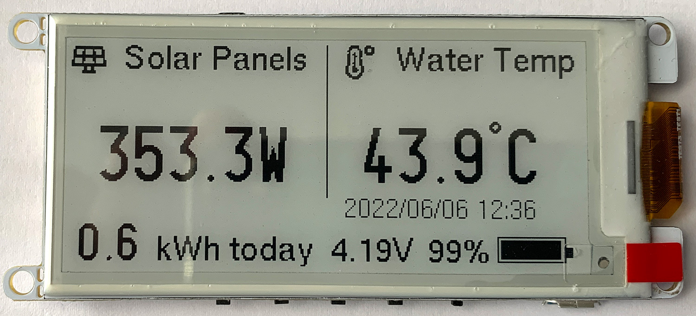

# Home Assistant eink remote display
A remote display showing Home Assistant data  on a 2.9 inch e-ink epaper display

More details about this project can be found on https://www.briandorey.com/ 



This project uses a DollaTek T5 V1.3 ESP32 2.9 inch EPaper Plus electronic ink screen development board from Amazon https://www.amazon.co.uk/gp/product/B07RXRX7V5/ which is a 2.9" e-paper module 296 x 128 pixels and runs on a ESP32 MCU. 

The data for the display is fetched from Home Assistant https://www.home-assistant.io/ via the REST Api https://developers.home-assistant.io/docs/api/rest/ and displays sensor data on the epaper display. 

The DollaTek T5 V1.3 is a rebranded Xinyuan LilyGO T5 2.9", version 2.2 display and this project is based on code and setup instructions from https://github.com/Xinyuan-LilyGO/LilyGo-T5-Epaper-Series and battery display from https://github.com/CybDis/Lilygo-T5-47-HomeAssistant-Dashboard/blob/master/src/main.cpp


## Getting Started

1. Install the following dependencies
     - [Adafruit-GFX-Library](https://github.com/adafruit/Adafruit-GFX-Library)
     - [lewisxhe/fork/GxEPD](https://github.com/lewisxhe/GxEPD)
     - [debsahu/HARestAPI](https://github.com/debsahu/HARestAPI)
     - [ArduinoJson](https://arduinojson.org/v6/doc/installation/)

2. Copy all the folders into  the libraries directory at `"C:\User\<YourName>\Documents\Arduino\libraries"`
3. In Arduino IDE, select `ESP32 Dev Module` in the development board, and keep the other options as default
4. If you do not find the ESP32 series in the development board, then you should see the following installation method [How to install ESP32 in ArduinoIDE](https://github.com/espressif/arduino-esp32/blob/master/docs/arduino-ide/boards_manager.md)
5. In your Home Assistant install, select the profile page and generate a new `Long-Lived Access Tokens`

## Configuration 

In epaperdisplay/epaperdisplay.ino update the following lines to your wifi and network settings.
```
// Network Settings
const char* ssid = "YOURWIFISSID";
const char* password = "YOURWIFIPASSWORD";
/* Put StaticIP Address details */
IPAddress local_ip(192.168.1.1); // Set static IP
IPAddress gateway(192.168.1.1); // Set network Gateway IP
IPAddress subnet(255, 255, 255, 0); // Set static IP
IPAddress primaryDNS(8, 8, 8, 8);   //optional
IPAddress secondaryDNS(8, 8, 4, 4); //optional
```
Enter your Home Assistant IP address and access token. 
```
// Home Assistant IP and token key
const char* ha_ip = "192.168.1.10";
uint16_t ha_port = 8123; // Could be 443 is using SSL
const char* ha_pwd = "YOURTOKEN";  //long-lived password. On HA, Profile > Long-Lived Access Tokens > Create Token
```
Set your sleep period in minutes between the display updates
```
// deep sleep configurations
long SleepDuration   = 1; // Sleep time in minutes
```
Overnight sleep mode (optional)

The DoNightSleep() function allows you to sleep the display for a selected number of hours, line 137 sets the number of minutes to sleep, the code is set ass 540 which is 9 hours. 
```
 SleepTimer = (540 * 60);
 ```
 Lines 173 to 176 allow you to set the time that NightSleep is enabled with the hour being obtained from a time sensor in Home Assistant called: `sensor.date_time_iso`
 ```
 if (timevar[11] == '2' && timevar[12] == '2') {
          TRACE("night sleep");
          //DoNightSleep();
        }
```
The sensors which are shown on the display are set with:
```
float fltHotWater = ParseSensorJsonData( ha.sendGetHA("/api/states/sensor.hot_water_top"));
  //String val = ha.sendGetHA("/api/states/sensor.hot_water_top");
  TRACE("Hot Water Top: ");
  TRACE(fltHotWater);

  float fltSolarPVWatts = ParseSensorJsonData( ha.sendGetHA("/api/states/sensor.solarpv_total_meter_gridpower"));
  TRACE("Solar PV Watts: ");
  TRACE(fltSolarPVWatts);

  float fltSolarPVGenerated = ParseSensorJsonData( ha.sendGetHA("/api/states/sensor.solarpv_todaygenerated"));
  TRACE("Solar PV Generated: ");
  TRACE(fltSolarPVGenerated);


  ParseTimeJsonData( ha.sendGetHA("/api/states/sensor.date_time_iso"));
  ```

  ## Battery Monitoring (optional)
  If you are running the display from a battery you can add a battery meter to the display using the `DrawBattery()` function. This is using code modified from https://github.com/CybDis/Lilygo-T5-47-HomeAssistant-Dashboard/tree/master/src

  ## Power Consumption

We measured the current consumption using a Keysight 34461A 6½ digit, Performance Truevolt DMM and our Keysight Oscilloscope measuring across a 1-ohm resistor and calculated the current from the resulting voltage.

The display was powered using a EEMB 3.7V 1100mAh 603449 Lipo Battery Rechargeable Lithium Polymer ion Battery Pack (https://www.amazon.co.uk/gp/product/B08FD39Y5R) 

Removing R32 which is the enable pullup on the audio IC reduced the hibernate power consumption by an additional 5mA. 

The wake and update state uses approx. 153mA and this takes under 0.4 seconds to connect to WiFi and retrieve the data, the display then takes 3.5 seconds to update then the board goes back to hibernate mode. 

| Mode               | Current in mA| 
|--------------------|--------------|
|WiFi Connected Peak |160           | 
|Deep sleep          |46.5          |
|Green LED Removed   |45.8          |
|Update from REST API|153           |
|Hibernation mode    |6.8           |
|R32 audio pullup removed|1.8       |